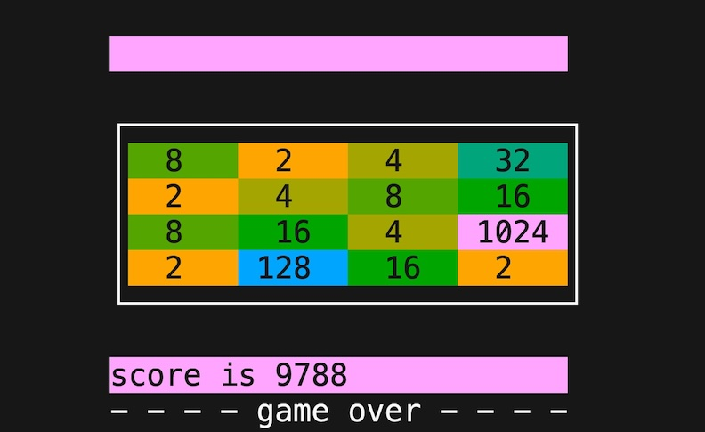

# `x800`: fast and minimal ANSI TERM *2048*
### *ɛks eɪt ˈhʌndrəd*

## Introduction

How fast? A sustained update rate of 34200 input-process-output cycles per second on an Pentium G3220T from 2013.

This project was created in part as a hands-on spike project for the author to learn [rustlang](rust-lang.org) as an experienced C and C++ systems software developer.

The name `x800` is the number `2048` in base sixteen, modified to comply with Cargo's package naming rules which disallow a leading digit in package names.

It was also an exercise in creating a working program of substantial size with minimal external dependencies. It doesn't use ncurses. The only dependency is the `libc` crate, which is already included in rustlang's `std` – so depending how you count it, `x800` has either zero dependencies or one.

With the above in mind, choices were made to write the code in an idiomatic as possible style, and in general follow the principle of least surprise.

## Preview


## Quick start
`x800` should run on any UNIX-like system targeted by a Rust toolchain with support for the Rust 2021 epoch. The target machine will also need to be targeted by the Cargo `libc` crate and provide the `/dev/urandom` device.

The [rustup](https://rustup.rs) tool can be used to install the required Rust toolchain on your build host.

### Running `x800` with `cargo run`

Check out the repository and use `cargo run`:

```sh
git clone 'https://github.com/evelynlewis/x800.git'
cd x800
cargo run --release
```

### Installation with Cargo

If you wish to install the program in your home directory, while still managed by Cargo, that can be done with:

```sh
git clone 'https://github.com/evelynlewis/x800.git'
cargo install --path x800
```

Then the binary can be run from any directory with:

```sh
x800
```

### Uninstallation with Cargo

To uninstall the binary:

```sh
cargo uninstall x800
```

## Cross-compilation with `cross` crate

In case you wanted to play 2048 on a somewhat more underpowered or exotic platform, the `cross` crate can be used to cross-compile from a better-supported host.

Here's an example which I tested on an x86-64 Linux box to build `x800` targeting a Raspberry Pi Zero W:

```sh
cargo install cross
cross build --release --target=arm-unknown-linux-gnueabihf
```

### Compatibility note

Docker is used by `cross` behind the scenes, so a working installation and a build host supported by the appropriate `cross` crate Docker image is required.

Note that with the default `cross` setup, Macs with ARM seem not to be supported as a build host. I didn't look into it much further at the time since I had another machine on hand.

```sh
# On an M1 MacOS host, this fails like so:
cross build --release --target=arm-unknown-linux-gnueabihf
Unable to find image 'ghcr.io/cross-rs/arm-unknown-linux-gnueabihf:0.2.5' locally
0.2.5: Pulling from cross-rs/arm-unknown-linux-gnueabihf
docker: no matching manifest for linux/arm64/v8 in the manifest list entries.
See 'docker run --help'.
```

# Mini-benchmarks

Since `x800` takes input from `stdin` and exits at the completion of a game, random games can be played by sending a stream of random moves to `stdin`. Monitoring the speed of characters being read from input and the typical time required to finish a gave provides a reasonable benchmark.

## Using the `hyperfine` tool

hyperfine is [described](https://nnethercote.github.io/perf-book/benchmarking.html) by *The Rust Performance Book* as "an excellent general-purpose benchmarking tool." I seems to deliver.

Requires GNU `base32`, `tr`, `pv`, and a recent version of [hyperfine](https://github.com/sharkdp/hyperfine).

*Note: The `hyperfine` binary can be installed via your system package manager or with* `cargo install hyperfine`. Your package manager's version may be too old.

```sh
cat /dev/urandom \
    | base32 \
    | tr '[:upper:]' '[:lower:]' | tr -dC 'asdw' \
    | pv --rate --average \
    | hyperfine -N ./target/release/x800 -n x800 --input /dev/stdin --style=color --warmup 128 --runs 1024
```

### Results: mini hyperfine benchmark on 1.1 Intel(R) Pentium(R) CPU G3220T @ 2.60GHz
```sh
cat /dev/urandom \
    | base32 \
    | tr '[:upper:]' '[:lower:]' | tr -dC 'asdw' \
    | pv --rate --average \
    | hyperfine -N ./target/release/x800 -n x800 --input /dev/stdin --style=color --warmup 256 --runs 2048
Benchmark 1: x800
  Time (mean ± σ):       2.8 ms ±   0.6 ms    [User: 1.7 ms, System: 1.0 ms]
  Range (min … max):     1.6 ms …   5.5 ms    2048 runs

[33.4KiB/s] [33.4KiB/s]

```
### Results: mini hyperfine benchmark on M1 MacBook Air
```sh
 cat /dev/urandom \
    | gbase32 \
    | tr '[:upper:]' '[:lower:]' | tr -dC 'asdw' \
    | pv --rate --average-rate \
    | hyperfine -N ./target/release/x800 -n x800 --input /dev/stdin --style=color --warmup 256 --runs 2048
Benchmark 1: x800
  Time (mean ± σ):       2.6 ms ±   0.5 ms    [User: 0.9 ms, System: 1.5 ms]
  Range (min … max):     1.4 ms …   4.9 ms    2048 runs

[33.7KiB/s] [33.7KiB/s]
```

## Using shell tools

Requires GNU `base32`, `tr`, `dash`, `grep`, and `pv`.

```sh
cat /dev/urandom \
    | base32 \
    | tr -s '[:upper:]' '[:lower:]' | tr -dC 'asdw' \
    | pv --rate --average-rate \
    | dash -c 'while true; do x800; done' \
    | pv --line-mode --rate --wait --average > /dev/null
```

### Results: mini shell benchmark on 1.1 Intel(R) Pentium(R) CPU G3220T @ 2.60GHz results
```sh
# Intel(R) Pentium(R) CPU G3220T @ 2.60GHz using shell tools
 cat /dev/urandom \
    | base32 \
    | tr -s '[:upper:]' '[:lower:]' | tr -dC 'asdw' \
    | pv --wait --rate --average-rate \
    | dash -c 'while true; do x800; done' > /dev/null
[25.8KiB/s] [27.2KiB/s]
```
### Results: mini shell benchmark on M1 MacBook Air
```sh
# M1 MacBook Air late 2020 using shell tools
cat /dev/urandom \
    | gbase32 \
    | tr -s '[:upper:]' '[:lower:]' | tr -dC 'asdw' \
    | pv --rate --average-rate \
    | dash -c 'while true; do x800; done' > /dev/null
[23.3KiB/s] [23.2KiB/s]
```


## License
[MIT License](LICENSE.txt)

## References
- [*ANSI escape code*](https://en.wikipedia.org/wiki/ANSI_escape_code)
- [*The TTY demystified*](http://www.linusakesson.net/programming/tty/)
- [*Zero-dependency random number generation in Rust*](https://blog.orhun.dev/zero-deps-random-in-rust/)
- [*termios(3) — Linux manual page*](https://man7.org/linux/man-pages/man3/termios.3.html)
- [*The Rust Performance Book*](https://nnethercote.github.io/perf-book)