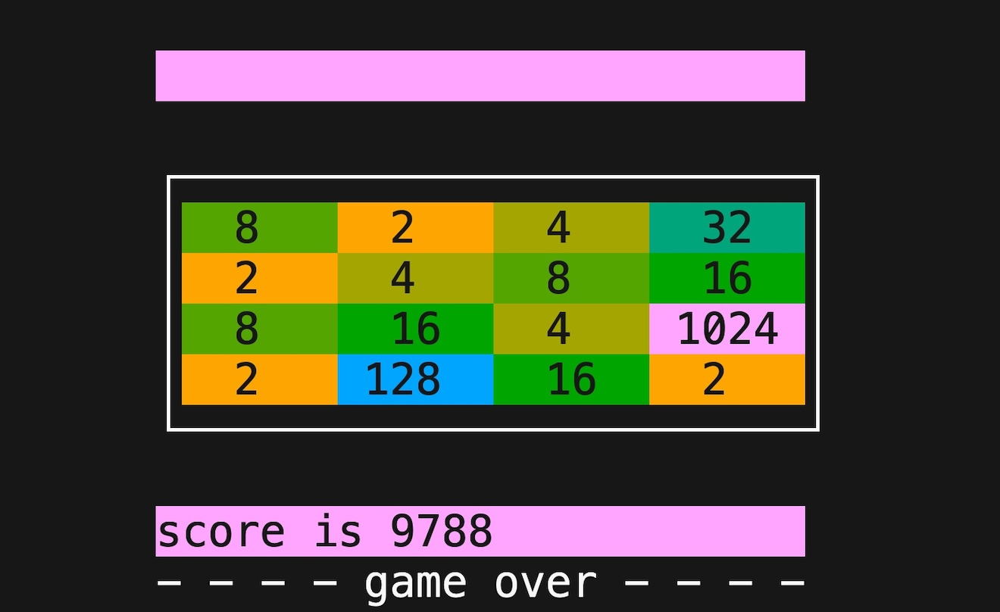

# `x800`: a fast and minimal *2048* for POSIX
### *ɛks eɪt ˈhʌndrəd*

# Introduction

How fast? A sustained update rate of approximately 3.68 million moves-per-second on a Pentium G3220T from 2013.

This project was created in part as a hands-on spike project for the author to learn [rustlang](rust-lang.org) as an experienced C and C++ systems software developer.

The name `x800` is the number `2048` in base sixteen, modified to comply with Cargo's package naming rules which disallow a leading digit in package names.

This project was also an exercise in creating a program of substantial size with a low number of external dependencies. It doesn't use ncurses. The only external build dependency is [`fastrand`](https://crates.io/crates/fastrand) – a simple PRNG Crate, without child dependencies. The program also requires a POSIX-compatible `libc` crate, which is already included in rustlang's `std` when building for POSIX targets.

With the above in mind, choices were made to write the code in an idiomatic as possible style, and in general follow the principle of least surprise.

# Preview


# Gameplay

`x800` gameplay is similar to the original *2048*, with the main difference being that for implementation simplicity, letter key are used in place of arrow keys for movement.

The keys ('w', 'a', 's', 'd') are used for (up, left, down, right) moves respectively. Since *2048* also supports letter keys, this a focused implementation of the *2048* concept.

[Wikipedia](https://en.wikipedia.org/wiki/2048_(video_game)):

> 2048 is played on a plain 4×4 grid, with numbered tiles that slide when a player moves them using the four arrow keys. The game begins with two tiles already in the grid, having a value of either 2 or 4, and another such tile appears in a random empty space after each turn. Tiles slide as far as possible in the chosen direction until they are stopped by either another tile or the edge of the grid. If two tiles of the same number collide while moving, they will merge into a tile with the total value of the two tiles that collided.

# Compatibility
`x800` has the following requirements:
- Rust toolchain requirements:
  - Toolchain supports Rust 2021 Edition (version 1.56.0 or better)
  - Target system's target-triple is supported.
  - Target's `libc` is POSIX-conforming.
- The OS provides a `/dev/urandom` device.
  - > Note: this is common but technically not part of POSIX.

This means that Linux, MacOS, other BSDs, QNX, and MinGW should all work, and on a variety of architectures.

> Note: Refer to the Rust [Platform Support](https://doc.rust-lang.org/rustc/platform-support.html) page and Rust `libc` [documentation](https://docs.rs/libc/latest/libc/).

> Note: For straightforward cross-compilation, see the related [section](#cross-compilation-with-cross-crate) below.

# Quick start
The [rustup](https://rustup.rs) tool can be used to install the required Rust toolchain on your build host.

## Running `x800` with `cargo run`

Check out the repository and use `cargo run`:

```sh
git clone 'https://github.com/evelynlewis/x800.git'
cd x800
cargo run --release
```

## Installation with Cargo

If you wish to install the program in your home directory, while still managed by Cargo, that can be done with:

```sh
git clone 'https://github.com/evelynlewis/x800.git'
cargo install --path x800
```

Then the binary can be run from any directory with:

```sh
x800
```

## Uninstallation with Cargo

To uninstall the binary:

```sh
cargo uninstall x800
```

# Cross-compilation with `cross` Crate

In case you wanted to play 2048 on a somewhat more underpowered or exotic platform, the `cross` Crate can be used to cross-compile from a better-supported host.

Here's an example which I tested on an x86-64 Linux box to build `x800` targeting a Raspberry Pi Zero W:

```sh
cargo install cross
cross build --release --target=arm-unknown-linux-gnueabihf
```

## Compatibility note

Docker is used by `cross` behind the scenes, so a working installation and a build host supported by the appropriate `cross` Crate Docker image is required.

Note that with the default `cross` setup, Macs with ARM seem not to be supported as a build host.
I didn't look into it much further at the time since I had another machine on hand.

```sh
# On an M1 MacOS host, this fails like so:
cross build --release --target=arm-unknown-linux-gnueabihf
Unable to find image 'ghcr.io/cross-rs/arm-unknown-linux-gnueabihf:0.2.5' locally
0.2.5: Pulling from cross-rs/arm-unknown-linux-gnueabihf
docker: no matching manifest for linux/arm64/v8 in the manifest list entries.
See 'docker run --help'.
```

# Mini-benchmarks

Since `x800` takes input from `stdin` and exits at the completion of a game, random games can be played by sending a stream of random moves to `stdin`.
Monitoring the speed of characters being read from input and the typical time required to finish a game provides a reasonable benchmark.

## Notes on benchmark result interpretation
  1. `[ N MiB/s]` corresponds to `N × 1024²`, or `N × 1048576` discrete directional moves processed by `x800` per second.

  2. `hyperfine` latency numbers correspond to the duration of a complete randomly-run game, beginning-to-end.

  3. When using an in-memory file as input, below referred to as "`hyperfine` with in-memory input pre-generation", it's difficult to measure the rate at which random moves are consumed by `x800`. Nonetheless, looking at the below benchmark results, it can be said with some certainty that `x800` is  limited by the current alternative of live-generating moves from /dev/urandom during a benchmark scenario. This is done by by converting to base32, converting to the stream to lowercase, and then dropping non-matching moves. Therefore, the multi-million move-per-second results realized by this method act can be seen as a lower bound on `x800` performance.

## Mini-benchmarks using the `hyperfine` tool

`hyperfine` is [described](https://nnethercote.github.io/perf-book/benchmarking.html) by *The Rust Performance Book* as "an excellent general-purpose benchmarking tool."
It seems to deliver.

These benchmarks require GNU `base32`, `tr`, `pv`, and a recent version of [`hyperfine`](https://github.com/sharkdp/hyperfine).

> Note: The `hyperfine` binary can be installed via your system package manager or with `cargo install hyperfine`. Your package manager's version may be too old.

### `hyperfine` with in-memory input pre-generation

```sh
cat etc/bench.sh 
#!/bin/sh

set -ex

touch /tmp/moves 
hyperfine --prepare 'etc/gen-moves.sh /tmp/moves' --warmup=256 --runs=1024 --input=/tmp/moves -N target/release/x800

```

#### M1 MacBook Air running MacOS

```sh
./etc/bench.sh  
+ touch /tmp/moves
+ hyperfine --prepare 'etc/gen-moves.sh /tmp/moves' --warmup=256 --runs=1024 --input=/tmp/moves -N target/release/x800
Benchmark 1: target/release/x800
  Time (mean ± σ):       1.7 ms ±   0.2 ms    [User: 0.8 ms, System: 0.6 ms]
  Range (min … max):     1.3 ms …   2.5 ms    1024 runs

```

#### Intel(R) Pentium(R) CPU G3220T @ 2.60GHz running Linux 6.5
```sh
./etc/bench.sh 
+ touch /tmp/moves
+ hyperfine --prepare etc/gen-moves.sh /tmp/moves --warmup=256 --runs=1024 --input=/tmp/moves -N target/release/x800
Benchmark 1: target/release/x800
  Time (mean ± σ):       2.1 ms ±   0.4 ms    [User: 1.6 ms, System: 0.4 ms]
  Range (min … max):     1.3 ms …   3.2 ms    1024 runs

```

### hyperfine with input live-generation

> Note: MacOS arguments and tool names modified slightly.

```sh
cat /dev/urandom \
    | base32 \
    | tr '[:upper:]' '[:lower:]' | tr -dC 'asdw' \
    | pv --rate --average \
    | hyperfine -N ./target/release/x800 -n x800 --input /dev/stdin --style=color --warmup 256 --runs 1024
```

#### M1 MacBook Air running MacOS

```sh
cat /dev/urandom \
    | gbase32 \
    | tr '[:upper:]' '[:lower:]' | tr -dC 'asdw' \
    | pv --rate --average-rate \
    | hyperfine -N ./target/release/x800 -n x800 --input /dev/stdin --style=color --warmup 256 --runs 1024

Benchmark 1: x800
  Time (mean ± σ):       2.8 ms ±   1.2 ms    [User: 0.8 ms, System: 0.6 ms]
  Range (min … max):     1.2 ms …   5.4 ms    1024 runs
 
[2.77MiB/s] [2.77MiB/s]
```

#### Intel(R) Pentium(R) CPU G3220T @ 2.60GHz running Linux 6.5

```sh
cat /dev/urandom \
    | base32 \
    | tr '[:upper:]' '[:lower:]' | tr -dC 'asdw' \
    | pv --rate --average \
    | hyperfine -N ./target/release/x800 -n x800 --input /dev/stdin --style=color --warmup 256 --runs 1024
Benchmark 1: x800
  Time (mean ± σ):       2.2 ms ±   0.4 ms    [User: 1.6 ms, System: 0.3 ms]
  Range (min … max):     1.3 ms …   3.9 ms    1024 runs
 
[3.51MiB/s] [3.51MiB/s]
```

## Mini-benchmarks using shell tools

Requires GNU `base32`, `tr`, `dash`, `grep`, and `pv`.

> Note: MacOS arguments and tool names modified slightly.

```sh
cat /dev/urandom \
    | base32 \
    | tr -s '[:upper:]' '[:lower:]' | tr -dC 'asdw' \
    | pv --wait --rate --average-rate \
    | dash -c 'while true; do ./target/release/x800; done' > /dev/null
```

#### Intel(R) Pentium(R) CPU G3220T @ 2.60GHz running Linux 6.5

```sh
# Intel(R) Pentium(R) CPU G3220T @ 2.60GHz using shell tools
cat /dev/urandom \
    | base32 \
    | tr -s '[:upper:]' '[:lower:]' | tr -dC 'asdw' \
    | pv --wait --rate --average-rate \
    | dash -c 'while true; do ./target/release/x800; done' > /dev/null
[3.67MiB/s] [3.57MiB/s]
```

#### M1 MacBook Air running MacOS
```sh
# M1 MacBook Air late 2020 using shell tools
cat /dev/urandom \
    | gbase32 \
    | tr -s '[:upper:]' '[:lower:]' | tr -dC 'asdw' \
    | pv --rate --average-rate \
    | dash -c 'while true; do ./target/release/x800; done' > /dev/null
[2.68MiB/s] [2.68MiB/s]
```

# License
[MIT License](LICENSE.txt)

# References
- [*ANSI escape code*](https://en.wikipedia.org/wiki/ANSI_escape_code)
- [*The TTY demystified*](http://www.linusakesson.net/programming/tty/)
- [*Zero-dependency random number generation in Rust*](https://blog.orhun.dev/zero-deps-random-in-rust/)
- [*termios(3) — Linux manual page*](https://man7.org/linux/man-pages/man3/termios.3.html)
- [*The Rust Performance Book*](https://nnethercote.github.io/perf-book)
- [*Clippy's Lints*](https://doc.rust-lang.org/stable/clippy/lints.html)
- [`hyperfine`](https://github.com/sharkdp/hyperfine)
