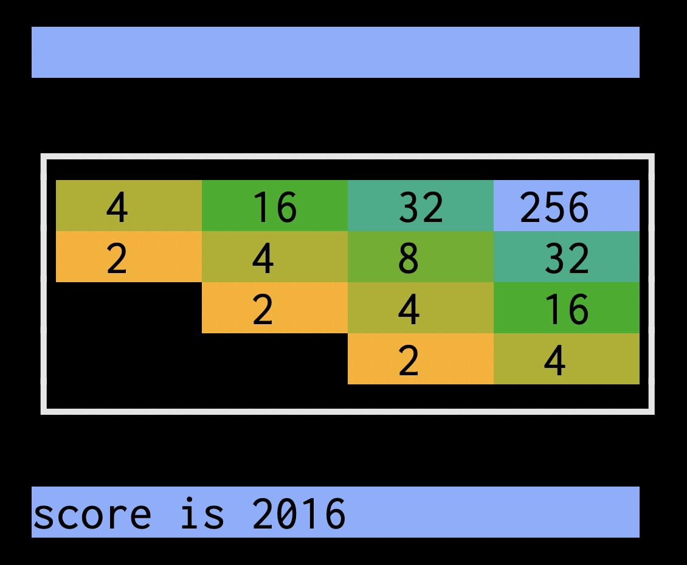

# `x800`: a fast and minimal *2048* for POSIX
### *ɛks eɪt ˈhʌndrəd*

# Introduction

How fast? A sustained update rate of around 3.4 million moves-per-second on a 4th Generation Intel Pentium G3220T from 2013.

This project was created in part as a hands-on spike project for the author to learn [rustlang](rust-lang.org) as an experienced C and C++ systems software developer.

The name `x800` is the number `2048` in base sixteen, modified to comply with Cargo's package naming rules which disallow a leading digit.

This project was also an exercise in creating a program of substantial size with a low number of external dependencies. It doesn't use ncurses. The only non-`std` dependency is [`fastrand`](https://crates.io/crates/fastrand) – a simple PRNG Crate, without child dependencies. The program also requires a POSIX-compatible `libc` crate, which is included in rustlang's `std` when building for POSIX targets. With the above in mind, choices were made to write the code in an as idiomatic as possible style, and in general follow the principle of least surprise.

# Preview


# Gameplay

`x800` gameplay is nearly identical to the original *2048*, with the difference that for implementation simplicity, only letter key are used as arrow keys for movement. Since *2048* also supports letter keys, this a focused implementation of the *2048* concept.

The keys ('w', 'a', 's', 'd') are used for (up, left, down, right) moves respectively. 

A description of *2048* gameplay, from [Wikipedia](https://en.wikipedia.org/wiki/2048_(video_game)):

> 2048 is played on a plain 4×4 grid, with numbered tiles that slide when a player moves them using the four arrow keys. The game begins with two tiles already in the grid, having a value of either 2 or 4, and another such tile appears in a random empty space after each turn. Tiles slide as far as possible in the chosen direction until they are stopped by either another tile or the edge of the grid. If two tiles of the same number collide while moving, they will merge into a tile with the total value of the two tiles that collided.

# Compatibility
`x800` has the following requirements:
- Rust toolchain requirements:
  - Toolchain supports Rust 2021 Edition (version 1.56.0 or better)
  - Target system's target-triple is supported.
  - Target's `libc` is POSIX-conforming.

This means that Linux, MacOS, other BSDs, QNX, and MinGW should all work, and on a variety of architectures.

> Note: Refer to the Rust [Platform Support](https://doc.rust-lang.org/rustc/platform-support.html) page and Rust `libc` [documentation](https://docs.rs/libc/latest/libc/). For `libc` the platform drop-down at the page top is useful.

> Note: For straightforward cross-compilation, see the related [section](#cross-compilation-with-cross-crate) below.

# Quick start
## Pre-setup
The [rustup](https://rustup.rs) tool can be used to install the required Rust toolchain including `cargo` on your build host.

## Installation with Cargo
To install the program locally:
```sh
cargo install --git 'https://github.com/evelynlewis/x800.git'
```

To run:
```sh
x800
```

## Uninstallation with Cargo

To uninstall the binary:
```sh
cargo uninstall x800
```

# Other setup
## Clone repository for local use

To set up `x800` for local testing and experimentation:
```sh
git clone 'https://github.com/evelynlewis/x800.git'
cd x800
cargo build
```

## Cross-compilation with `cross` Crate

In case you wanted to play 2048 on a somewhat more underpowered or unique platform, the [`cross`](https://github.com/cross-rs/cross) Crate can be used to cross-compile from a better-supported host.

This example was tested on both an x86-64 Linux box and an arm64 MacOS host. It builds `x800` to target a Raspberry Pi Zero W with target triple `arm-unknown-linux-gnueabihf`:

```sh
cargo install cross --git 'https://github.com/cross-rs/cross'
cross build --release --target=arm-unknown-linux-gnueabihf
```

# Mini-benchmarks

Since `x800` takes input from `stdin` and exits at the completion of a game, random games can be played by sending a stream of random moves to `stdin`.
Monitoring the speed of characters being read from input and the typical time required to finish a game provides a reasonable benchmark.

## Notes on benchmark result interpretation
  1. `[ N MiB/s]` corresponds to `N × 1024²`, or `N × 1048576` discrete directional moves processed by `x800` per second.

  2. `hyperfine` latency numbers correspond to the duration of a complete randomly-run game, beginning-to-end.

## Mini-benchmarks using the `hyperfine` tool

`hyperfine` is [described](https://nnethercote.github.io/perf-book/benchmarking.html) by *The Rust Performance Book* as "an excellent general-purpose benchmarking tool."
It seems to deliver.

These benchmarks require GNU `base32`, `tr`, `pv`, and a recent version of [`hyperfine`](https://github.com/sharkdp/hyperfine).

> Note: The `hyperfine` binary can be installed via your system package manager or with `cargo install hyperfine`. Your package manager's version may be too old.

### `hyperfine` with in-memory input pre-generation

#### M1 MacBook Air running MacOS

```sh
./util/bench.sh
+ test -d ./util/
+ test -f ./util/gen-moves.sh
+ cargo build -p x800 --release
    Finished release [optimized] target(s) in 0.03s
+ touch /tmp/moves
+ hyperfine --prepare './util/gen-moves.sh /tmp/moves' --warmup=256 --runs=256 --input=/tmp/moves -N ./target/release/x800
Benchmark 1: ./target/release/x800
  Time (mean ± σ):       1.4 ms ±   0.1 ms    [User: 0.7 ms, System: 0.4 ms]
  Range (min … max):     1.2 ms …   1.7 ms    256 runs
```

#### Intel(R) Pentium(R) CPU G3220T @ 2.60GHz running Linux 6.5
```sh
./util/bench.sh
+ test -d ./util/
+ test -f ./util/gen-moves.sh
+ cargo build -p x800 --release
    Finished release [optimized] target(s) in 0.07s
+ touch /tmp/moves
+ hyperfine --prepare ./util/gen-moves.sh /tmp/moves --warmup=256 --runs=256 --input=/tmp/moves -N ./target/release/x800
Benchmark 1: ./target/release/x800
  Time (mean ± σ):       1.4 ms ±   0.1 ms    [User: 1.1 ms, System: 0.2 ms]
  Range (min … max):     1.1 ms …   1.9 ms    256 runs
```

## Mini-benchmarks using shell tools

Requires GNU `base32`, `tr`, `dash`, `grep`, and `pv`.

> Note: MacOS arguments and tool names modified slightly, as provided below.

```sh
cat /dev/urandom \
    | base32 \
    | tr -s '[:upper:]' '[:lower:]' | tr -dC 'asdw' \
    | pv --wait --rate --average-rate \
    | dd bs=256 \
    | dash -c 'while true; do ./target/release/x800; done' > /dev/null
```

#### M1 MacBook Air running MacOS
```sh
cat /dev/urandom \
    | gbase32 \
    | tr -s '[:upper:]' '[:lower:]' | tr -dC 'asdw' \
    | dd bs=256 \
    | pv --wait --rate --average-rate \
    | dash -c 'while true; do ./target/release/x800; done' > /dev/null
[2.67MiB/s] [2.62MiB/s]
```

#### Intel(R) Pentium(R) CPU G3220T @ 2.60GHz running Linux 6.5
```sh
cat /dev/urandom \
    | base32 \
    | tr -s '[:upper:]' '[:lower:]' | tr -dC 'asdw' \
    | dd bs=256 \
    | pv --wait --rate --average-rate \
    | dash -c 'while true; do ./target/release/x800; done' > /dev/null
[3.25MiB/s] [3.21MiB/s]
```

# License
[MIT License](LICENSE.txt)

# References
- [*ANSI escape code*](https://en.wikipedia.org/wiki/ANSI_escape_code)
- [*The TTY demystified*](http://www.linusakesson.net/programming/tty/)
- [*Zero-dependency random number generation in Rust*](https://blog.orhun.dev/zero-deps-random-in-rust/)
- [*termios(3) — Linux manual page*](https://man7.org/linux/man-pages/man3/termios.3.html)
- [*The Rust Performance Book*](https://nnethercote.github.io/perf-book)
- [*Clippy's Lints*](https://doc.rust-lang.org/stable/clippy/lints.html)
- [`hyperfine`](https://github.com/sharkdp/hyperfine)
